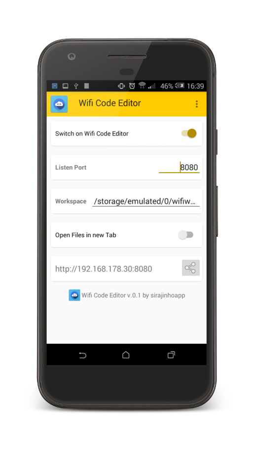

# wificodeeditor-ace
editor which allows you to edit files on your phone in your local WiFi from your PC.

Http server sends ACE Edtor File in a Frame with local Project Files and enables user to edit them in his PC.

  

